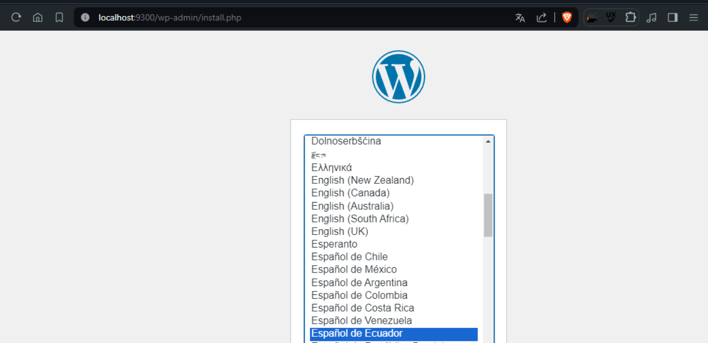
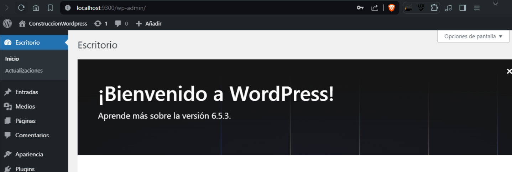
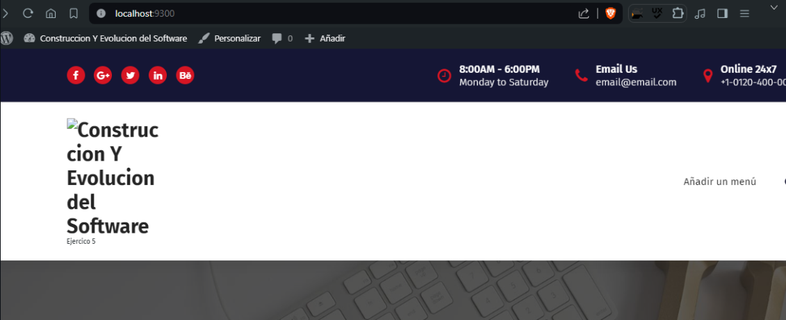

## Esquema para el ejercicio


### Crear la red
# COMPLETAR /
```
docker network create net-wp
```

### Crear el contenedor mysql a partir de la imagen mysql:8, configurar las variables de entorno necesarias
# COMPLETAR/
```
docker run -d --name mysql-container --network net-wp -e MYSQL_ROOT_PASSWORD=my-secret-pw -e MYSQL_DATABASE=wordpress -e MYSQL_USER=wp_user -e MYSQL_PASSWORD=wp_password mysql:8
```

### Crear el contenedor wordpress a partir de la imagen: wordpress, configurar las variables de entorno necesarias
# COMPLETAR/
```
docker run -d --name wordpress-container --network net-wp -e WORDPRESS_DB_HOST=mysql-container:3306 -e WORDPRESS_DB_USER=wp_user -e WORDPRESS_DB_PASSWORD=wp_password -e WORDPRESS_DB_NAME=wordpress -p 9300:80 wordpress
```
De acuerdo con el trabajo realizado, en la el esquema de ejercicio el puerto a es 9300

Ingresar desde el navegador al wordpress y finalizar la configuración de instalación.
# COLOCAR UNA CAPTURA DE LA CONFIGURACIÓN


Desde el panel de admin: cambiar el tema y crear una nueva publicación.
Ingresar a: http://localhost:9300/ 
recordar que a es el puerto que usó para el mapeo con wordpress
# COLOCAR UNA CAPTURA DEL SITO EN DONDE SEA VISIBLE LA PUBLICACIÓN.


### Eliminar el contenedor wordpress
# COMPLETAR/
```
docker rm -f wordpress-container
```
### Crear nuevamente el contenedor wordpress
Ingresar a: http://localhost:9300/ 
recordar que a es el puerto que usó para el mapeo con wordpress

### ¿Qué ha sucedido, qué puede observar?
# COMPLETAR /
La pagina no muestra nada solo es una pantalla si nada, podria ser que al eliminar el contenedor también se eliminan todos los datos almacenados dentro de ese contenedor y aunque se cree otro esos datos ya fueron eliminados


